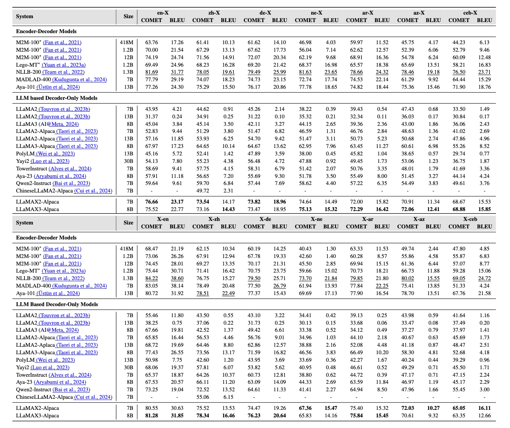
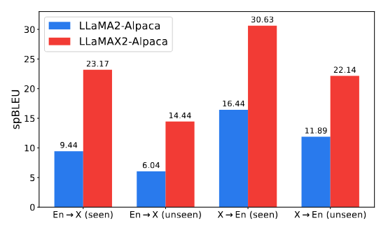
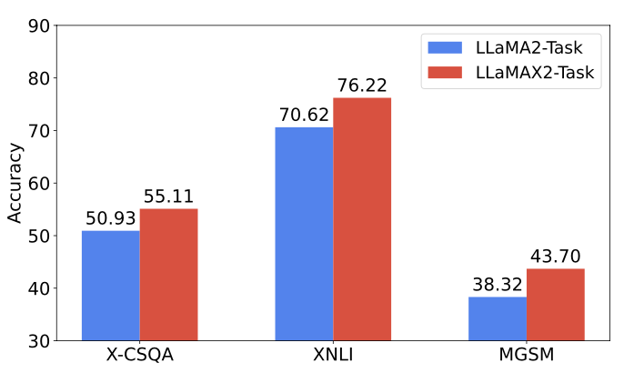

# LLaMAX: Scaling Linguistic Horizons of LLM by Enhancing Translation Capabilities Beyond 100 Languages

[**HuggingFace**](https://huggingface.co/LLaMAX) | [**Arxiv**](http://arxiv.org/abs/2407.05975) | [**Citation**](#citation) |

LLaMAX is a large language model designed for multilingual scenarios. It is based on Meta's LLaMA series models and 
continues training on over 100 languages. Without losing its generalization ability, the multilingual capabilities of LLaMAX 
significantly exceeds that of existing LLMs. Only simple supervised fine-tuning(SFT) is needed to meet multilingual requirements in downstream tasks.

## News
**🔥[Jul 6, 2024] Released the multilingual math reasoning model [LLaMAX2-7B-MetaMath](https://huggingface.co/LLaMAX/LLaMAX2-7B-MetaMath), only trained on English MGSM dataset**

**🔥[Jul 6, 2024] Released the multilingual natural language inference model [LLaMAX2-7B-XNLI](https://huggingface.co/LLaMAX/LLaMAX2-7B-XNLI), only trained on English MultiNLI dataset**

**🔥[Jul 6, 2024] Released the multilingual commonsense reasoning model [LLaMAX2-7B-X-CSQA](https://huggingface.co/LLaMAX/LLaMAX2-7B-X-CSQA), only trained on five English commonsense reasoning datasets, including X-CSQA, ARC-Easy, ARC-Challenge, OpenBookQA, and QASC.**

**🔥[Jul 6, 2024] Released the multilingual instruction-tuned models [LLaMAX2-7B-Alpaca](https://huggingface.co/LLaMAX/LLaMAX2-7B-Alpaca), [LLaMAX3-8B-Alpaca](https://huggingface.co/LLaMAX/LLaMAX3-8B-Alpaca), only trained on English instruction data [Alpaca](https://github.com/tatsu-lab/stanford_alpaca)**

**🔥[Jul 6, 2024] Released the multilingual base models [LLaMAX2-7B](https://huggingface.co/LLaMAX/LLaMAX2-7B), [LLaMAX3-8B](https://huggingface.co/LLaMAX/LLaMAX3-8B)**

## Model Download
We implement multiple versions of the LLaMAX model, the model links are as follows:

| Model          | Description                                                                                                                                          | HuggingFace Model Path                                                   |
|----------------|------------------------------------------------------------------------------------------------------------------------------------------------------|--------------------------------------------------------------------------|
| LLaMAX2-7B | base model                                                                                                                                           | [LLaMAX2-7B](https://huggingface.co/LLaMAX/LLaMAX2-7B)                   |
| LLaMAX3-8B | base model                                                                                                                                           | [LLaMAX3-8B](https://huggingface.co/LLaMAX/LLaMAX3-8B)                   |
| LLaMAX2-7B-Alpaca | instruction-tuned model, trained on Alpaca data                                                                                                      | [LLaMAX2-7B-Alpaca](https://huggingface.co/LLaMAX/LLaMAX2-7B-Alpaca)     |
| LLaMAX3-8B-Alpaca| instruction-tunedmodel, trained on Alpaca data                                                                                                       | [LLaMAX3-8B-Alpaca](https://huggingface.co/LLaMAX/LLaMAX3-8B-Alpaca)     |
| LLaMAX2-7B-X-CSQA | commonsense reasoning model | [LLaMAX/LLaMAX2-7B-X-CSQA](https://huggingface.co/LLaMAX/LLaMAX2-7B-X-CSQA) |
| LLaMAX2-7B-XNLI | natural language inference model                                                                                       | [LLaMAX2-7B-XNLI](https://huggingface.co/LLaMAX/LLaMAX2-7B-XNLI)         |
| LLaMAX2-7B-MetaMath | math reasoning model                                                                                                   | [LLaMAX2-7B-MetaMath](https://huggingface.co/LLaMAX/LLaMAX2-7B-MetaMath) |

## Results
**Note that all the following results are obtained using the zero-shot setting. If you want to reproduce our model's results on translation tasks, you can refer to [**this tutorial**](./scripts/README.md). For the commonsense reasoning, natural language inference and math reasoning tasks, you can use evaluation scripts from [this repo](https://github.com/CONE-MT/MindMerger).** 

LLaMAX2-Alpaca achieves an average spBLEU score improvement of over 10 points compared to the corresponding LLaMA2-Alpaca model on the Flores-101 dataset.
We also evaluate other LLMs emphasizing multilingual capabilities and translation models. 
The translation ability of our model is significantly higher than other LLMs and on par with the strongest translation models. For a detailed analysis, please refer to Table 4 in [our paper](http://arxiv.org/abs/2407.05975).



We evaluate the languages in Flores-200 that are not covered by the training data (unseen). 
As shown in the left figure, our model still shows significant improvements.

For more downstream tasks, we fine-tuned LLaMAX using only the English training set, which also shows significant improvements in non-English. 
We provide evaluation results in the right figure for multilingual testset of the following three tasks: 
Commonsense Reasoning, Natural Language Inference and Math Reasoning.


<p float="left">
  
  
</p>

## Supported Languages
[language list](./supported_languages.csv)

<a name="citation"></a>
## Citation
If our model helps your work, please cite this paper:
```
@article{lu2024llamax,
  title={LLaMAX: Scaling Linguistic Horizons of LLM by Enhancing Translation Capabilities Beyond 100 Languages},
  author={Lu, Yinquan and Zhu, Wenhao and Li, Lei and Qiao, Yu and Yuan, Fei},
  journal={arXiv preprint arXiv:2407.05975},
  year={2024}
}
```
